# Diagrama de Clases — Plataforma Fintech

## A. Dominio + Estructuras propias

```mermaid
classDiagram
    class `TablaHash~K,V~` {
        <<O(1) avg put/get/remove>>
        +put(k, v) void
        +get(k) Optional~V~
        +remove(k) boolean
        +containsKey(k) boolean
        +size() int
        +keys() Iterable~K~
    }
    class `MiLista~T~` {
        <<O(n) add, O(1) addFirst>>
        +add(e) void
        +addFirst(e) void
        +get(i) T
        +remove(i) T
        +removeFirst() Optional~T~
        +size() int
        +iterator() Iterator~T~
    }
    class `Pila~T~` {
        <<O(1) push/pop/peek>>
        +push(e) void
        +pop() Optional~T~
        +peek() Optional~T~
        +isEmpty() boolean
        +size() int
    }
    class `ColaSimple~T~` {
        <<O(1) enqueue/dequeue>>
        +enqueue(e) void
        +dequeue() Optional~T~
        +peek() Optional~T~
        +isEmpty() boolean
        +size() int
    }
    class `ColaPrioridad~T~` {
        <<O(log n) add/poll>>
        +add(e) void
        +poll() Optional~T~
        +peek() Optional~T~
        +isEmpty() boolean
        +size() int
    }
    class `ArbolBST~T~` {
        <<O(log n) avg insert, O(n) inOrder>>
        +insert(e) void
        +contains(e) boolean
        +remove(e) boolean
        +inOrder() Iterable~T~
        +inOrderDescending() Iterable~T~
        +size() int
    }
    class GrafoTransferencias {
        <<O(V+E) findCycles/frequentRoutes>>
        +addNode(userId) void
        +addEdge(src, tgt, amount) void
        +outEdges(userId) Iterable~Edge~
        +nodes() Iterable~String~
        +nodeCount() int
        +edgeCount() int
        +frequentRoutes(min) Iterable~Route~
        +findCycles() List~List~String~~
    }
    note for `GrafoTransferencias~T~` "findCycles returns java.util.List inside domain.structures (boundary helper, ADR-9.1). The public port TransferGraphRepository.findCycles() returns MiLista~MiLista~String~~."
    class `Conjunto~T~` {
        <<O(1) avg add/contains>>
        +add(v) void
        +contains(v) boolean
        +size() int
        +isEmpty() boolean
        +iterator() Iterator~T~
        +of(values)$ Conjunto~T~
    }
    class Usuario {
        -id String
        -name String
        -email String
        -registeredAt Instant
        -points double
        -loyaltyLevel LoyaltyLevel
        +addPoints(delta) boolean
        +spendPoints(amount) void
        +getId() String
        +getPoints() double
        +getLoyaltyLevel() LoyaltyLevel
    }
    class Billetera {
        -code String
        -name String
        -type String
        -ownerId String
        -balance double
        -active boolean
        -transactionCount int
        +getBalance() double
        +setBalance(b) void
        +getCode() String
    }
    class Transaccion {
        -id String
        -timestamp Instant
        -type TransactionType
        -status TransactionStatus
        -amount double
        -sourceWalletId String
        -targetWalletId String
        -sourceUserId String
        -targetUserId String
        -pointsGenerated double
        -description String
        -reversible boolean
        -riskLevel FraudSeverity
        +setStatus(s) void
        +markRiskLevel(s) void
        +addBonusPoints(bonus) void
    }
    class OperacionProgramada {
        -id String
        -type ScheduledOperationType
        -status ScheduledOperationStatus
        -sourceUserId String
        -sourceWalletId String
        -targetUserId String
        -targetWalletId String
        -amount double
        -scheduledAt Instant
        -description String
        -recurrence RecurrenceType
        +markExecuted() void
        +markCancelled() void
        +markFailed() void
    }
    class Beneficio {
        -id String
        -name String
        -description String
        -pointsCost int
        -active boolean
        +getId() String
        +getName() String
        +getPointsCost() int
        +isActive() boolean
    }
    class BenefitRedemption {
        <<record>>
        +id String
        +userId String
        +benefitId String
        +pointsSpent int
        +redeemedAt Instant
    }
    class Notificacion {
        -id String
        -userId String
        -type NotificationType
        -severity NotificationSeverity
        -read boolean
    }
    class FraudEvent {
        -id String
        -userId String
        -transactionId String
        -type String
        -severity FraudSeverity
        -description String
        -createdAt Instant
    }
    class LoyaltyLevel {
        <<enumeration>>
        BRONZE
        SILVER
        GOLD
        PLATINUM
    }
    class TransactionType {
        <<enumeration>>
        RECHARGE
        WITHDRAWAL
        INTERNAL_TRANSFER_SENT
        INTERNAL_TRANSFER_RECEIVED
        EXTERNAL_TRANSFER_SENT
        EXTERNAL_TRANSFER_RECEIVED
    }
    class TransactionStatus {
        <<enumeration>>
        COMPLETED
        REVERSED
    }
    class ScheduledOperationType {
        <<enumeration>>
        RECHARGE
        WITHDRAWAL
    }
    class ScheduledOperationStatus {
        <<enumeration>>
        PENDING
        EXECUTED
        CANCELLED
        FAILED
    }
    class RecurrenceType {
        <<enumeration>>
        NONE
        DAILY
        WEEKLY
        MONTHLY
    }
    class NotificationType {
        <<enumeration>>
        LOW_BALANCE
        TRANSACTION
        FRAUD_ALERT
        POINTS_LEVEL
        SYSTEM
        SCHEDULED_REMINDER
        OPERATION_REJECTED
        BENEFIT_REDEEMED
    }
    class NotificationSeverity {
        <<enumeration>>
        INFO
        WARNING
        CRITICAL
    }
    class FraudSeverity {
        <<enumeration>>
        LOW
        MEDIUM
        HIGH
    }
    class ErrorCode {
        <<enumeration>>
        USER_NOT_FOUND
        WALLET_NOT_FOUND
        TRANSACTION_NOT_FOUND
        DUPLICATE_EMAIL
        INSUFFICIENT_FUNDS
    }
    class DomainException {
        <<abstract sealed>>
        +code() ErrorCode
        +getMessage() String
    }
    class NotFoundException {
        +code() ErrorCode
    }
    class DuplicatedResourceException {
        +code() ErrorCode
    }
    class BusinessRuleException {
        +code() ErrorCode
    }
    class LoyaltyLevelCalculator {
        <<utility>>
        +from(points) LoyaltyLevel$
    }
    class PuntosCalculator {
        <<utility>>
        +compute(type, amount) double$
    }
    class FraudDetector {
        +detect(tx) Optional~FraudEvent~
    }

    DomainException <|-- NotFoundException
    DomainException <|-- DuplicatedResourceException
    DomainException <|-- BusinessRuleException
    DomainException --> ErrorCode
    Usuario --> LoyaltyLevel
    Transaccion --> TransactionType
    Transaccion --> TransactionStatus
    OperacionProgramada --> ScheduledOperationType
    OperacionProgramada --> ScheduledOperationStatus
    OperacionProgramada --> RecurrenceType
    Notificacion --> NotificationType
    Notificacion --> NotificationSeverity
    FraudEvent --> FraudSeverity
    LoyaltyLevelCalculator --> LoyaltyLevel
    PuntosCalculator --> TransactionType
    FraudDetector --> FraudEvent
    GrafoTransferencias *-- `TablaHash~K,V~`
    GrafoTransferencias *-- `MiLista~T~`
```

## B. Aplicación (use cases + ports)

```mermaid
classDiagram
    class UserRepository {
        <<interface>>
        +save(u) void
        +findById(id) Optional~Usuario~
        +existsById(id) boolean
        +findAll() Iterable~Usuario~
        +deleteById(id) void
        +findByEmail(email) Optional~Usuario~
    }
    class WalletRepository {
        <<interface>>
        +save(w) void
        +findByCode(code) Optional~Billetera~
        +findByOwnerId(id) Iterable~Billetera~
        +delete(code) void
    }
    class TransactionRepository {
        <<interface>>
        +save(tx) void
        +findById(id) Optional~Transaccion~
        +findByUserId(id) Iterable~Transaccion~
        +findByWalletCode(c) Iterable~Transaccion~
        +findAll() Iterable~Transaccion~
    }
    class TransactionIdGenerator {
        <<interface>>
        +next() String
    }
    class ScheduledOperationRepository {
        <<interface>>
        +save(op) void
        +findById(id) Optional~OperacionProgramada~
        +findByUserId(id) Iterable~OperacionProgramada~
        +findPendingInPriorityOrder() Iterable~OperacionProgramada~
    }
    class ScheduledOperationIdGenerator {
        <<interface>>
        +next() String
    }
    class NotificationRepository {
        <<interface>>
        +save(n) void
        +findByUserId(id) Iterable~Notificacion~
        +deleteByUserId(id) void
    }
    class NotificationIdGenerator {
        <<interface>>
        +next() String
    }
    class FraudEventRepository {
        <<interface>>
        +save(e) void
        +findAll() Iterable~FraudEvent~
        +deleteByUserId(id) void
    }
    class FraudEventIdGenerator {
        <<interface>>
        +next() String
    }
    class BeneficioRepository {
        <<interface>>
        +save(b) void
        +findById(id) Optional~Beneficio~
        +findAllActive() MiLista~Beneficio~
    }
    class BeneficioIdGenerator {
        <<interface>>
        +next() String
    }
    class BenefitRedemptionRepository {
        <<interface>>
        +save(r) void
        +findByUserId(id) MiLista~BenefitRedemption~
    }
    class BenefitRedemptionIdGenerator {
        <<interface>>
        +next() String
    }
    class ReversibleOperationsStack {
        <<interface>>
        +push(tx) void
        +pop() Optional~Transaccion~
        +peek() Optional~Transaccion~
    }
    class TransferGraphRepository {
        <<interface>>
        +addNode(id) void
        +addEdge(src, tgt, amount) void
        +getGraph() GrafoTransferencias
    }
    class CreateUserUseCase {
        +execute(cmd) UserView
    }
    class GetUserUseCase {
        +execute(id) UserView
    }
    class UpdateUserUseCase {
        +execute(cmd) UserView
    }
    class DeleteUserUseCase {
        +execute(id) void
    }
    class CreateWalletUseCase {
        +execute(cmd) Billetera
    }
    class ListWalletsUseCase {
        +execute(userId) Iterable~Billetera~
    }
    class RechargeWalletUseCase {
        +execute(cmd) Transaccion
    }
    class WithdrawWalletUseCase {
        +execute(cmd) Transaccion
    }
    class InternalTransferUseCase {
        +execute(cmd) Transaccion
    }
    class ExternalTransferUseCase {
        +execute(cmd) ExternalTransferResult
    }
    class ReverseTransactionUseCase {
        +execute(id) Transaccion
    }
    class GetUserPointsUseCase {
        +execute(userId) PointsView
    }
    class GetPointsRankingUseCase {
        +execute() List~RankingItem~
    }
    class GetAnalyticsSummaryUseCase {
        +execute() AnalyticsSummaryView
    }
    class GetTopUsersUseCase {
        +execute(limit) List~MetricItem~
    }
    class GetTopWalletsUseCase {
        +execute(limit) List~MetricItem~
    }
    class GetTopTransactionsUseCase {
        +execute(limit) List~MetricItem~
    }
    class GetFrequentRoutesUseCase {
        +execute(min) List~RouteMetric~
    }
    class GetCyclesUseCase {
        +execute() List~List~String~~
    }
    class GetMovementByTypeUseCase {
        +execute() List~MetricItem~
    }
    class GetTotalMovedInRangeUseCase {
        +execute(from, to) double
    }
    class GetTopWalletCategoriesUseCase {
        +execute(limit) List~MetricItem~
    }
    class ExecuteDueScheduledOperationsUseCase {
        +execute(now) ExecutionReport
    }
    class ListScheduledOperationsUseCase {
        +execute(userId) Iterable~OperacionProgramada~
    }
    class CancelScheduledOperationUseCase {
        +execute(id) void
    }
    class ListUserNotificationsUseCase {
        +execute(userId) Iterable~Notificacion~
    }
    class MarkNotificationAsReadUseCase {
        +execute(id) void
    }
    class ListFraudEventsUseCase {
        +execute() Iterable~FraudEvent~
    }
    class ListBenefitsUseCase {
        +execute() List~BenefitView~
    }
    class RedeemBenefitUseCase {
        +execute(cmd) BenefitRedemption
    }
    class ListUserRedemptionsUseCase {
        +execute(userId) List~BenefitRedemptionView~
    }
    class NotificationEmitter {
        +emitLowBalance(userId, code) void
        +emitLevelUp(userId, level) void
        +emitScheduledNear(userId, opId, scheduledAt) void
        +emitScheduledExecuted(userId, opId) void
        +emitScheduledRejected(userId, opId, reason) void
    }
    class UserView {
        <<record>>
        +id String
        +name String
        +email String
        +points double
        +loyaltyLevel LoyaltyLevel
    }
    class PointsView {
        <<record>>
        +userId String
        +points double
        +loyaltyLevel LoyaltyLevel
    }
    class RankingItem {
        <<record>>
        +position int
        +userId String
        +userName String
        +points double
        +loyaltyLevel LoyaltyLevel
    }
    class ExternalTransferResult {
        <<record>>
        +outgoing Transaccion
        +incoming Transaccion
    }
    class ExecutionReport {
        <<record>>
        +executed int
        +failed int
        +executedIds MiLista~String~
        +failedIds MiLista~String~
    }
    class BenefitView {
        <<record>>
        +id String
        +name String
        +description String
        +pointsCost int
        +active boolean
    }
    class BenefitRedemptionView {
        <<record>>
        +id String
        +userId String
        +benefitId String
        +pointsSpent int
        +redeemedAt String
    }
    class MetricItem {
        <<record>>
        +id String
        +label String
        +value double
    }
    class RouteMetric {
        <<record>>
        +source String
        +target String
        +count int
        +totalAmount double
    }
    class AnalyticsSummaryView {
        <<record>>
        +totalUsers int
        +totalWallets int
        +totalTransactions int
    }

    CreateUserUseCase --> UserRepository
    GetUserUseCase --> UserRepository
    UpdateUserUseCase --> UserRepository
    DeleteUserUseCase --> UserRepository
    DeleteUserUseCase --> WalletRepository
    DeleteUserUseCase --> TransactionRepository
    CreateWalletUseCase --> WalletRepository
    ListWalletsUseCase --> WalletRepository
    RechargeWalletUseCase --> WalletRepository
    RechargeWalletUseCase --> TransactionRepository
    RechargeWalletUseCase --> TransactionIdGenerator
    WithdrawWalletUseCase --> WalletRepository
    WithdrawWalletUseCase --> ReversibleOperationsStack
    InternalTransferUseCase --> WalletRepository
    ExternalTransferUseCase --> WalletRepository
    ExternalTransferUseCase --> TransferGraphRepository
    ReverseTransactionUseCase --> ReversibleOperationsStack
    ReverseTransactionUseCase --> TransactionRepository
    GetUserPointsUseCase --> UserRepository
    GetPointsRankingUseCase --> UserRepository
    GetAnalyticsSummaryUseCase --> UserRepository
    GetAnalyticsSummaryUseCase --> WalletRepository
    GetAnalyticsSummaryUseCase --> TransactionRepository
    GetFrequentRoutesUseCase --> TransferGraphRepository
    GetCyclesUseCase --> TransferGraphRepository
    ExecuteDueScheduledOperationsUseCase --> ScheduledOperationRepository
    ListScheduledOperationsUseCase --> ScheduledOperationRepository
    CancelScheduledOperationUseCase --> ScheduledOperationRepository
    ListUserNotificationsUseCase --> NotificationRepository
    MarkNotificationAsReadUseCase --> NotificationRepository
    ListFraudEventsUseCase --> FraudEventRepository
    ListBenefitsUseCase --> BeneficioRepository
    RedeemBenefitUseCase --> BeneficioRepository
    RedeemBenefitUseCase --> BenefitRedemptionRepository
    RedeemBenefitUseCase --> UserRepository
    RedeemBenefitUseCase --> BenefitRedemptionIdGenerator
    ListUserRedemptionsUseCase --> BenefitRedemptionRepository
    ListUserRedemptionsUseCase --> UserRepository
    NotificationEmitter --> NotificationRepository
    NotificationEmitter --> NotificationIdGenerator
```

## C. Infraestructura (adapters + REST + wiring)

```mermaid
classDiagram
    class InMemoryUserRepository {
        -store TablaHash
        +save(u) void
        +findById(id) Optional
        +findAll() Iterable
        +delete(id) void
    }
    class InMemoryWalletRepository {
        -store TablaHash
        +save(w) void
        +findByCode(code) Optional
        +findByOwnerId(id) Iterable
    }
    class InMemoryTransactionRepository {
        -store TablaHash
        -all MiLista
        +save(tx) void
        +findAll() Iterable
        +findByUserId(id) Iterable
    }
    class InMemoryScheduledOperationRepository {
        -store TablaHash
        -queue ColaPrioridad
        +save(op) void
        +findPendingInPriorityOrder() Iterable
    }
    class InMemoryNotificationRepository {
        -store TablaHash
        +save(n) void
        +findByUserId(id) Iterable
        +deleteByUserId(id) void
    }
    class InMemoryFraudEventRepository {
        -store MiLista
        +save(e) void
        +findAll() Iterable
        +deleteByUserId(id) void
    }
    class InMemoryReversibleOperationsStack {
        -stack Pila
        +push(tx) void
        +pop() Optional
        +peek() Optional
    }
    class InMemoryTransferGraphRepository {
        -graph GrafoTransferencias
        +addNode(id) void
        +addEdge(src, tgt, amount) void
        +getGraph() GrafoTransferencias
    }
    class SequentialTransactionIdGenerator {
        +next() String
    }
    class SequentialScheduledOperationIdGenerator {
        +next() String
    }
    class SequentialNotificationIdGenerator {
        +next() String
    }
    class SequentialFraudEventIdGenerator {
        +next() String
    }
    class InMemoryBeneficioRepository {
        -store TablaHash
        +save(b) void
        +findById(id) Optional
        +findAllActive() MiLista
    }
    class InMemoryBenefitRedemptionRepository {
        -store TablaHash
        +save(r) void
        +findByUserId(id) MiLista
    }
    class SequentialBeneficioIdGenerator {
        +next() String
    }
    class SequentialBenefitRedemptionIdGenerator {
        +next() String
    }
    class UserController {
        +createUser() ResponseEntity
        +getUser(id) ResponseEntity
        +updateUser(id) ResponseEntity
        +deleteUser(id) ResponseEntity
        +listUsers() ResponseEntity
    }
    class WalletController {
        +createWallet() ResponseEntity
        +listWallets(userId) ResponseEntity
    }
    class OperationsController {
        +recharge() ResponseEntity
        +withdraw() ResponseEntity
        +internalTransfer() ResponseEntity
        +reverseTransaction(id) ResponseEntity
    }
    class ExternalTransferController {
        +externalTransfer() ResponseEntity
    }
    class TransactionController {
        +listUserTransactions(userId) ResponseEntity
        +listWalletTransactions(code) ResponseEntity
    }
    class PointsController {
        +getUserPoints(userId) ResponseEntity
        +getRanking() ResponseEntity
    }
    class ScheduledOperationsController {
        +create() ResponseEntity
        +list(userId) ResponseEntity
        +cancel(id) ResponseEntity
        +executeDue() ResponseEntity
    }
    class NotificationsController {
        +list(userId) ResponseEntity
        +markRead(id) ResponseEntity
    }
    class AnalyticsController {
        +summary() ResponseEntity
        +topUsers() ResponseEntity
        +topWallets() ResponseEntity
        +topTransactions() ResponseEntity
        +cycles() ResponseEntity
        +frequentRoutes() ResponseEntity
        +movementByType() ResponseEntity
        +totalMoved() ResponseEntity
        +topWalletCategories() ResponseEntity
    }
    class FraudController {
        +listEvents() ResponseEntity
    }
    class BenefitController {
        +listBenefits() ResponseEntity
        +redeemBenefit(userId, benefitId) ResponseEntity
        +listRedemptions(userId) ResponseEntity
    }
    class HealthController {
        +health() ResponseEntity
    }
    class GlobalExceptionHandler {
        +handleDomainException() ResponseEntity
        +handleValidationException() ResponseEntity
    }
    class UserBeansConfig {
        +userRepository() UserRepository
        +createUserUseCase() CreateUserUseCase
    }
    class WalletBeansConfig {
        +walletRepository() WalletRepository
        +createWalletUseCase() CreateWalletUseCase
    }
    class OperationsBeansConfig {
        +rechargeWalletUseCase() RechargeWalletUseCase
        +reverseTransactionUseCase() ReverseTransactionUseCase
    }
    class PointsBeansConfig {
        +getUserPointsUseCase() GetUserPointsUseCase
        +getPointsRankingUseCase() GetPointsRankingUseCase
    }
    class ScheduledOperationsBeansConfig {
        +scheduledOpRepository() ScheduledOperationRepository
        +executeDueUseCase() ExecuteDueScheduledOperationsUseCase
    }
    class NotificationsBeansConfig {
        +notificationRepository() NotificationRepository
        +notificationEmitter() NotificationEmitter
    }
    class AnalyticsBeansConfig {
        +getAnalyticsSummaryUseCase() GetAnalyticsSummaryUseCase
        +getTopUsersUseCase() GetTopUsersUseCase
    }
    class FraudBeansConfig {
        +fraudEventRepository() FraudEventRepository
        +fraudDetector() FraudDetector
    }
    class BenefitBeansConfig {
        +beneficioRepository() BeneficioRepository
        +listBenefitsUseCase() ListBenefitsUseCase
        +redeemBenefitUseCase() RedeemBenefitUseCase
        +listUserRedemptionsUseCase() ListUserRedemptionsUseCase
    }
    class ClockConfig {
        +clock() Clock
    }

    InMemoryUserRepository ..|> UserRepository
    InMemoryWalletRepository ..|> WalletRepository
    InMemoryTransactionRepository ..|> TransactionRepository
    InMemoryScheduledOperationRepository ..|> ScheduledOperationRepository
    InMemoryNotificationRepository ..|> NotificationRepository
    InMemoryFraudEventRepository ..|> FraudEventRepository
    InMemoryReversibleOperationsStack ..|> ReversibleOperationsStack
    InMemoryTransferGraphRepository ..|> TransferGraphRepository
    SequentialTransactionIdGenerator ..|> TransactionIdGenerator
    SequentialScheduledOperationIdGenerator ..|> ScheduledOperationIdGenerator
    SequentialNotificationIdGenerator ..|> NotificationIdGenerator
    SequentialFraudEventIdGenerator ..|> FraudEventIdGenerator
    InMemoryBeneficioRepository ..|> BeneficioRepository
    InMemoryBenefitRedemptionRepository ..|> BenefitRedemptionRepository
    SequentialBeneficioIdGenerator ..|> BeneficioIdGenerator
    SequentialBenefitRedemptionIdGenerator ..|> BenefitRedemptionIdGenerator
```

## D. Frontend (páginas + stores + API)

```mermaid
classDiagram
    class UsersPage {
        <<React Component>>
        +render() JSX
    }
    class WalletsPage {
        <<React Component>>
        +render() JSX
    }
    class OperationsPage {
        <<React Component>>
        +render() JSX
    }
    class TransactionsPage {
        <<React Component>>
        +render() JSX
    }
    class PointsPage {
        <<React Component>>
        +render() JSX
    }
    class ScheduledOperationsPage {
        <<React Component>>
        +render() JSX
    }
    class NotificationsPage {
        <<React Component>>
        +render() JSX
    }
    class AnalyticsPage {
        <<React Component>>
        +render() JSX
    }
    class FraudPage {
        <<React Component>>
        +render() JSX
    }
    class useSelectionStore {
        <<Zustand Store>>
        +selectedUserId string
        +selectedWalletCode string
        +setSelectedUserId(id) void
        +setSelectedWalletCode(code) void
    }
    class useAppStore {
        <<Zustand Store>>
        +theme string
        +setTheme(t) void
    }
    class apiClient {
        <<module>>
        +get(url) Promise
        +post(url, body) Promise
        +patch(url, body) Promise
        +delete(url) Promise
    }
    class parseApiError {
        <<module>>
        +parseApiError(err) ApiError
    }
    class queryKeys {
        <<module>>
        +users object
        +wallets object
        +transactions object
        +points object
        +analytics object
        +fraud object
    }
    class usersApi {
        <<module>>
        +listUsers() Promise
        +getUser(id) Promise
        +createUser(dto) Promise
        +updateUser(id, dto) Promise
        +deleteUser(id) Promise
    }
    class walletsApi {
        <<module>>
        +listWallets(userId) Promise
        +createWallet(dto) Promise
    }
    class operationsApi {
        <<module>>
        +recharge(dto) Promise
        +withdraw(dto) Promise
        +internalTransfer(dto) Promise
        +externalTransfer(dto) Promise
        +reverseTransaction(id) Promise
    }
    class transactionsApi {
        <<module>>
        +listUserTransactions(userId) Promise
        +listWalletTransactions(code) Promise
    }
    class scheduledOperationsApi {
        <<module>>
        +list(userId) Promise
        +create(dto) Promise
        +cancel(id) Promise
        +executeDue() Promise
    }
    class notificationsApi {
        <<module>>
        +list(userId) Promise
        +markRead(id) Promise
    }
    class analyticsApi {
        <<module>>
        +getSummary() Promise
        +getTopUsers() Promise
        +getCycles() Promise
        +getFrequentRoutes() Promise
    }
    class fraudApi {
        <<module>>
        +listEvents() Promise
    }
    class Button {
        <<shared component>>
        +variant string
        +render() JSX
    }
    class Card {
        <<shared component>>
        +render() JSX
    }
    class Input {
        <<shared component>>
        +render() JSX
    }
    class Field {
        <<shared component>>
        +label string
        +render() JSX
    }
    class AppLayout {
        <<layout component>>
        +render() JSX
    }
    class LoyaltyBadge {
        <<shared component>>
        +level LoyaltyLevel
        +render() JSX
    }
    class SeverityBadge {
        <<shared component>>
        +severity NotificationSeverity
        +render() JSX
    }
    class FraudSeverityBadge {
        <<shared component>>
        +severity FraudSeverity
        +render() JSX
    }

    UsersPage --> usersApi
    UsersPage --> useSelectionStore
    WalletsPage --> walletsApi
    WalletsPage --> useSelectionStore
    OperationsPage --> operationsApi
    OperationsPage --> useSelectionStore
    TransactionsPage --> transactionsApi
    TransactionsPage --> useSelectionStore
    PointsPage --> usersApi
    PointsPage --> LoyaltyBadge
    ScheduledOperationsPage --> scheduledOperationsApi
    NotificationsPage --> notificationsApi
    NotificationsPage --> SeverityBadge
    AnalyticsPage --> analyticsApi
    FraudPage --> fraudApi
    FraudPage --> FraudSeverityBadge
    usersApi --> apiClient
    walletsApi --> apiClient
    operationsApi --> apiClient
    transactionsApi --> apiClient
    scheduledOperationsApi --> apiClient
    notificationsApi --> apiClient
    analyticsApi --> apiClient
    fraudApi --> apiClient
    apiClient --> parseApiError
```

## Notas de lectura

- Las flechas con punta abierta ascendente (`<|--`) indican implementación de interfaz o herencia.
- Las flechas con punta cerrada (`*--`) indican composición.
- Las flechas con punta abierta direccional (`-->`) indican dependencia/uso.
- Las flechas de realización (`..||>`) indican que una clase implementa una interfaz.
- Big-O mostrado entre `<<>>` indica complejidad de la operación clave.
